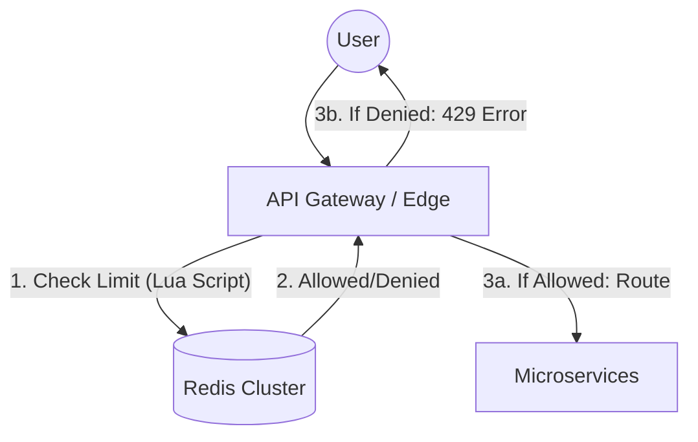
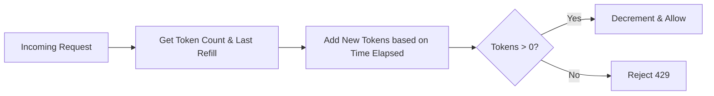

# System Design Workflow

Reference: [Hello Interview - Design a Rate Limiter by Evan](https://www.youtube.com/watch?v=MIJFyUPG4Z4&t=1063s)

## 1. Requirements (<5 minutes)
- What are the functional and non functional requirements?

### Functional Requirements
- **Identify Clients:** Identify users by User ID, IP address, or API key.
- **Limit Requests:** Limit requests based on configurable rules (e.g., 100 requests per minute).
- **Error Handling:** Return proper error headers and HTTP status codes (429 Too Many Requests).

### Non Functional Requirements
- **CAP Theorem:** Prioritize **Availability** over Consistency. The system should remain functional even if reading slightly outdated rules during propagation.
- **Low Latency:** Rate limit checks must be extremely fast, aiming for **under 10 milliseconds** per request.
- **Scalability:** Must scale to handle **1 million requests per second** for 100 million daily active users.
- **Fault Tolerance:** The system must be resilient to failures in the underlying storage (e.g., Redis).

### Out of Scope
- Client-side rate limiting (easily spoofed and less valuable in this context).
- Building a custom interactive frontend for rule management.

## 2. Core Entities (<3 minutes)
- **Request:** The incoming network call to be evaluated.
- **Client:** The unique identifier for the user (IP, User ID, or API Key).
- **Rule:** The configuration defining the limit (e.g., 100 requests/sec).

## 3. API (<5 minutes)
- **System Interface (Internal RPC/Function Call):**
    - `isRequestAllowed(clientId, ruleId)` -> Returns `{ allowed: boolean, remaining: int, resetTime: timestamp }`.

## 4. Data Flow
- Incoming Request -> API Gateway/Edge -> Rate Limiter Check (Redis) -> Allow/Reject -> (If Allowed) Forward to Microservice.

---

Up to here, you should have only spent about 15 minutes, this gives you 20 minute for your high level design and deep Dives

---

## 5. High Level Design

- **API Gateway (Edge Placement)**
    - **responsibility:** Acts as the entry point and "bouncer." It checks the rate limiter before routing requests to backend services.
    - **incoming:** Client/User.
    - **outgoing:** Rate Limiter (Redis), Backend Microservices.

- **Distributed Cache (Redis)**
    - **responsibility:** Stores the global state for rate limits (token counts and timestamps) to ensure coordination across multiple gateway instances.
    - **incoming:** API Gateway.

- **Backend Microservices**
    - **responsibility:** Process the actual business logic (e.g., Social Media Feed) only after the request has passed the rate limit check.
    - **incoming:** API Gateway.

## 6. Deep Dives

- **Token Bucket Algorithm**
    - **techstack:** Redis Lua Scripting.
    - **how it work:** Each client has a "bucket" of tokens that refills at a steady rate. A request consumes one token. If the bucket is empty, the request is rejected.
    - **how it improve system:** Atomically handles bursts and sustained loads while avoiding race conditions via single-threaded Lua scripts.

- **Scalability via Sharding**
    - **techstack:** Redis Cluster (Hash Slots).
    - **how it work:** Since one Redis instance handles ~50k-100k ops/sec, the data is sharded across ~20+ nodes based on Client ID.
    - **how it improve system:** Allows the system to scale to the required 1 million requests per second.

- **Dynamic Configuration Management**
    - **techstack:** Zookeeper or etcd.
    - **how it work:** Rules are pushed to gateways via a persistent TCP connection (watch mechanism) and stored in local memory.
    - **how it improve system:** Enables real-time rule updates without redeploying gateways or increasing check latency.

---

## Diagrams:

### High Level Architecture

### Rate Limiter Logic (Token Bucket)
