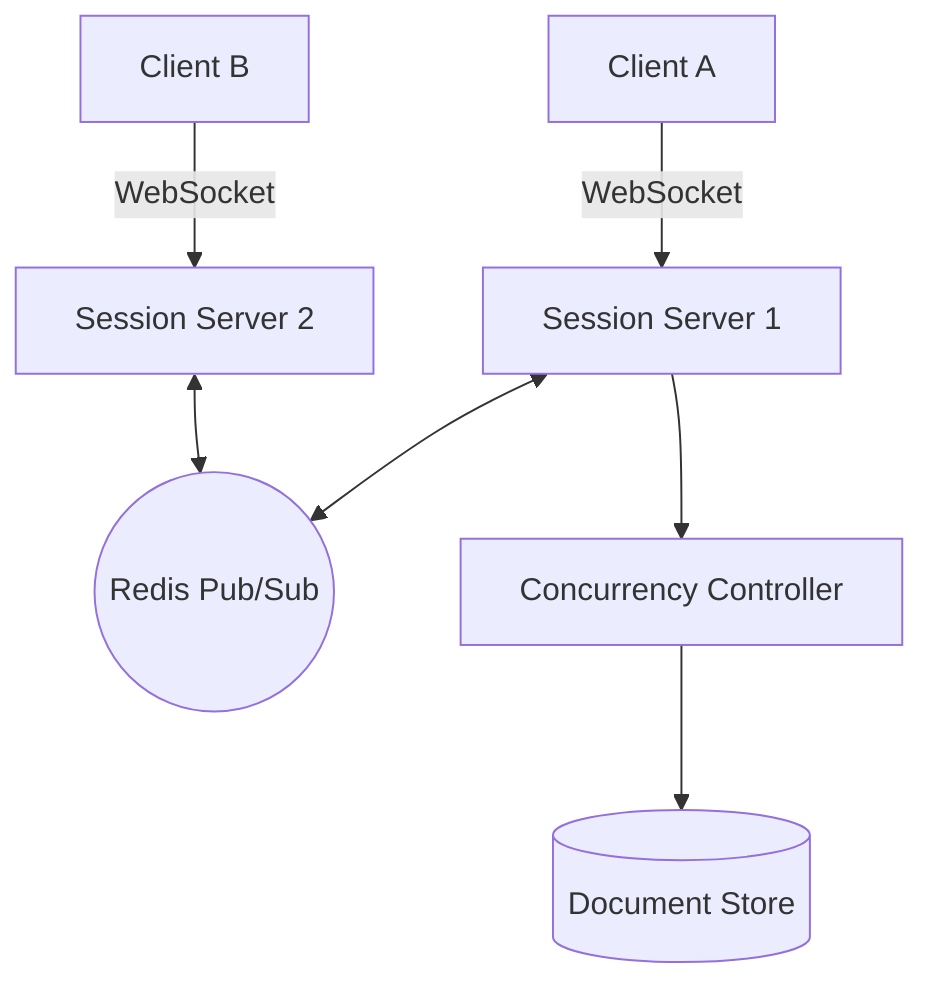
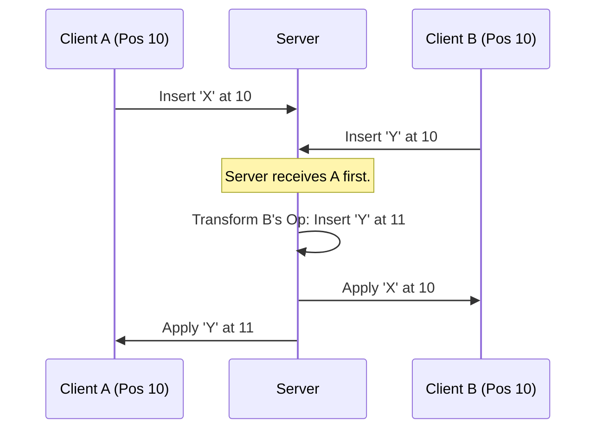

# System Design Workflow

**Reference:** Google Gemini (AI Knowledge Synthesis)

## 1. Requirements

### Functional Requirements

*   **Collaborative Editing:** Multiple users can edit the same document simultaneously.
*   **Real-time Sync:** Changes made by one user are visible to others with sub-second latency.
*   **Conflict Resolution:** System handles overlapping edits (e.g., two people typing in the same spot).
*   **Presence:** Show who is currently viewing or editing the document (cursors).

### Non Functional Requirements

*   **Low Latency:** Character inserts should feel instantaneous (less than 100ms).
*   **High Availability:** Users must be able to access and edit documents 24/7.
*   **Consistency:** Prioritize **Strong Eventual Consistency**. Every user must eventually see the exact same document state.
*   **Scalability:** Must support millions of concurrent documents and hundreds of editors per doc.

### Out of Scope

*   Document permissions/sharing logic (IAM).
*   Version history/Snapshotting (though implied by the data model).
*   Exporting to PDF/Word.

## 2. Core Entities

*   **Document:** The container for the content and metadata.
*   **Operation:** A single change (Insert, Delete, Retain) at a specific position.
*   **User:** Participant in the session.
*   **Session:** A live connection between a client and a document.

## 3. API

*   **Create/Open Doc (REST):** `GET /docs/{docId}` -> Returns initial document state and a WebSocket URL.
*   **Submit Operation (WebSocket):** `sendOp(docId, operation, revision)` -> Sends a local change to the server.
*   **Broadcast Operation (WebSocket):** `onOp(operation)` -> Server pushes a remote change to all connected clients.

## 4. Data Flow

*   Client opens doc -> Fetches snapshot from DB -> Opens WebSocket to **Session Server** -> Client sends edit **Operation** -> Server transforms/re-sequences -> Server broadcasts to others and persists to DB.

## 5. High Level Design

*   **API Gateway**
    *   **responsibility:** Authentication and routing. Directs initial "Open" requests to the Doc Service.
    *   **incoming:** Client.
    *   **outgoing:** Doc Service, Session Service.

*   **Doc Service (State Service)**
    *   **responsibility:** Fetches the full document state (snapshots) from the database for initial loading.
    *   **incoming:** API Gateway.
    *   **outgoing:** Relational DB (Metadata), NoSQL/Blob (Content).

*   **Session Service (Relay)**
    *   **responsibility:** Manages persistent WebSocket connections. Relays operations between clients and the Concurrency Controller.
    *   **incoming:** Client (WebSockets).
    *   **outgoing:** Concurrency Controller.

*   **Concurrency Controller**
    *   **responsibility:** The "Brain." It receives operations, resolves conflicts using OT or CRDT logic, and assigns a global sequence number.
    *   **incoming:** Session Service.
    *   **outgoing:** Persistence Layer, Session Service (Broadcast).

## 6. Deep Dives

*   **Conflict Resolution (Operational Transformation - OT)**
    *   **techstack:** OT Algorithm (similar to Apache Wave).
    *   **how it work:** If User A and User B both insert a character at index 10, the server "transforms" User B's operation to index 11 so they don't overwrite each other.
    *   **how it improve your system:** Ensures all clients converge to the same final string without requiring a global lock on the document.

*   **Real-time Communication (WebSockets + Redis Pub/Sub)**
    *   **techstack:** Redis Pub/Sub.
    *   **how it work:** Since users on the same doc might be connected to different Session Servers, the servers use Redis to "subscribe" to a `docId`. When an op is confirmed, it's published to the Redis channel.
    *   **how it improve your system:** Allows the system to scale horizontally to millions of users while maintaining sub-100ms broadcast latency.

*   **Memory Optimization (Snapshotting)**
    *   **how it work:** Instead of replaying 1 million "insert" operations every time a doc opens, the system saves a "snapshot" every 100 operations.
    *   **responsibility:** Dramatically reduces the initial load time for large, long-lived documents.

## Diagrams:

### High Level Design

### Operational Transformation (OT) Logic
