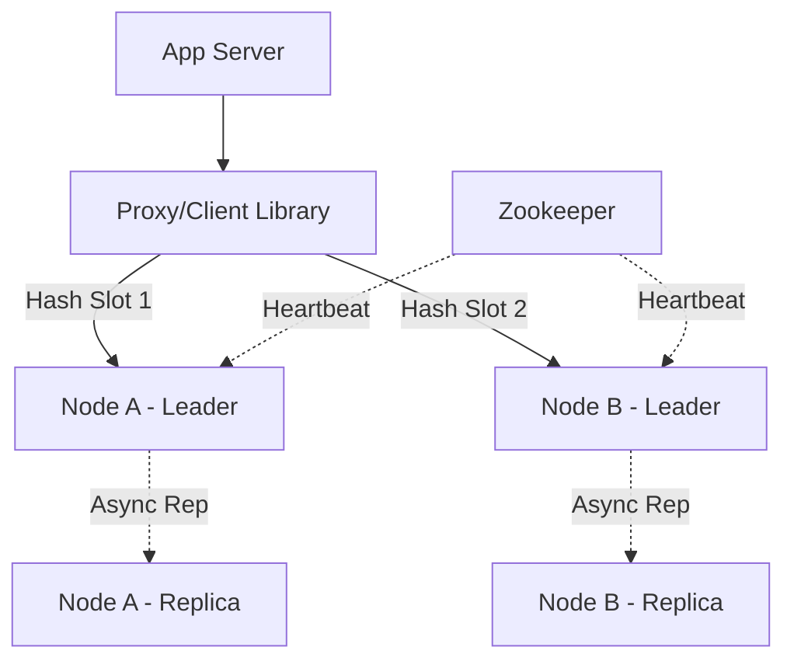
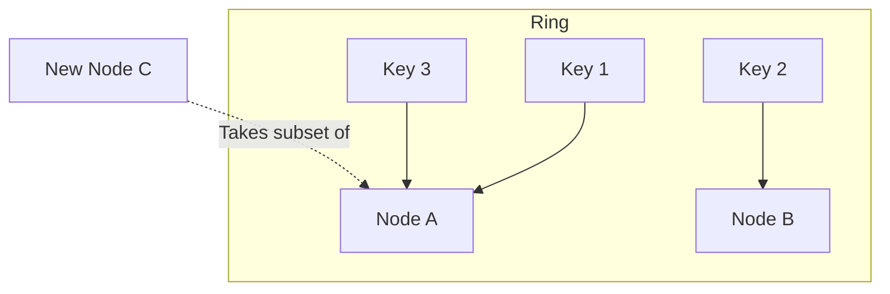

# System Design Workflow

Reference: Google Gemini (AI Knowledge Synthesis)

## 1. Requirements

*   What are the functional and non-functional requirements?

### Functional Requirements

*   **Put/Set:** Store a key-value pair in the cache with an optional TTL (Time To Live).
*   **Get:** Retrieve the value associated with a specific key with sub-millisecond latency.
*   **Eviction:** Automatically remove old or least-used data when memory is full.
*   **Expiration:** Delete keys automatically after their TTL expires.

### Non-Functional Requirements

*   **Low Latency:** Aim for sub-millisecond response times for Get/Set operations.
*   **Scalability:** Must support horizontal scaling to handle terabytes of data and millions of requests per second.
*   **Availability vs. Consistency:** Prioritize Availability (AP in CAP). Eventual consistency is acceptable during network partitions or master-slave failovers.
*   **High Throughput:** Optimized for read-heavy workloads but capable of high-frequency writes.

### Out of Scope

*   Complex ACID transactions (focusing on atomic operations instead).
*   Advanced data structures like Geospatial or Streams (sticking to Strings/Hashes/Lists).
*   Persistent disk storage as a primary source (Disk is for backup/snapshots only).

## 2. Core Entities

*   **Cache Entry:** A record containing the Key, Value, TTL, and Metadata (last accessed time).
*   **Node:** An individual server instance holding a segment of the data.
*   **Shard Map:** A mapping of keys to specific nodes (Consistent Hashing).

## 3. API

*   **Store Data:** `SET(key, value, ttl?)` -> Returns `OK`.
*   **Retrieve Data:** `GET(key)` -> Returns `value | null`.
*   **Remove Data:** `DEL(key)` -> Returns `1 | 0`.
*   **Atomic Increment:** `INCR(key)` -> Returns the new integer value.

## 4. Data Flow

*   Client calculates the hash of the Key -> Client/Proxy identifies the target Shard/Node -> Request sent to Node -> Node performs in-memory lookup -> Result returned to Client.

---

## 5. High Level Design

*   **Client/Proxy (Twemproxy/Envoy)**
    *   **Responsibility:** Routes requests to the correct cache node using consistent hashing to minimize data movement during scaling.
    *   **Incoming:** Application Servers.
    *   **Outgoing:** Cache Nodes (Shards).

*   **Cache Node (Leader)**
    *   **Responsibility:** Processes read/write requests in-memory and manages local eviction/expiration logic.
    *   **Additional info:** Each node maintains an in-memory Hash Table for O(1) lookups.
    *   **Incoming:** Proxy/Client.
    *   **Outgoing:** Follower Nodes (Replication).

*   **Follower Node (Replica)**
    *   **Responsibility:** Maintains a copy of the Leader's data for high availability and read scaling.
    *   **Incoming:** Leader Node (Asynchronous Replication).

*   **Configuration Provider (Zookeeper/Etcd)**
    *   **Responsibility:** Tracks the health of all nodes and maintains the global shard map.
    *   **Incoming:** Proxy, Cache Nodes.

## 6. Deep Dives

*   **Consistent Hashing**
    *   **Techstack:** Ketama Algorithm / Hash Slots.
    *   **How it works:** Keys and Nodes are mapped onto a logical circle (0 to $2^{32}-1$). A key is assigned to the first node encountered moving clockwise.
    *   **How it improves the system:** Prevents a "cache storm" when adding/removing nodes by ensuring only $1/n$ of keys need to be remapped.

*   **Eviction Policy (LRU - Least Recently Used)**
    *   **Techstack:** Doubly Linked List + Hash Map.
    *   **How it works:** When memory limit is reached, the system removes the element at the "tail" of the linked list (the one not accessed for the longest time).
    *   **How it improves the system:** Ensures the "hottest" data stays in memory, maximizing hit rate.

*   **Storage Engine (SSTables/In-memory Hash)**
    *   **How it works:** Uses a single-threaded event loop (like Redis) to avoid lock contention and context switching overhead.
    *   **Responsibility:** Achieves maximum throughput by utilizing CPU cache and avoiding expensive mutexes.

---

## Diagrams:

### High Level Architecture

### Consistent Hashing Ring

