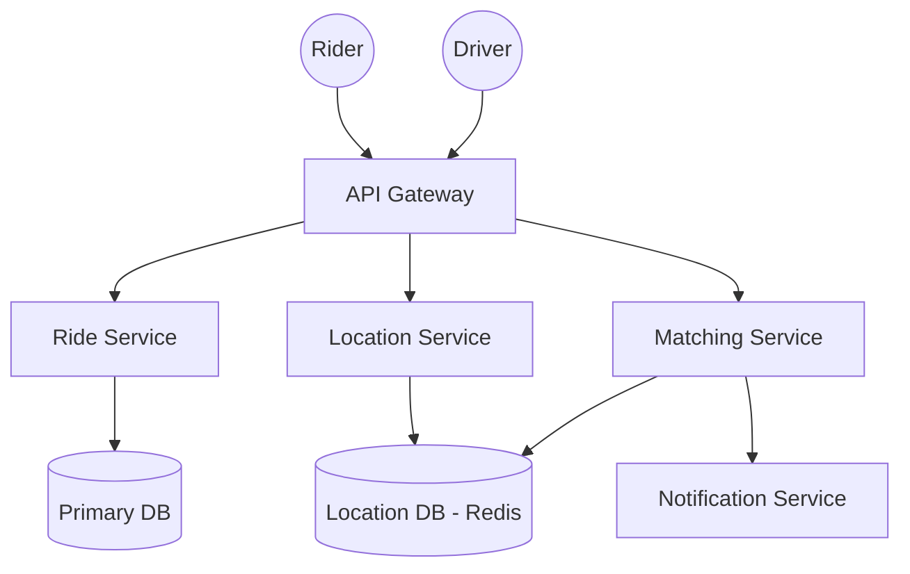
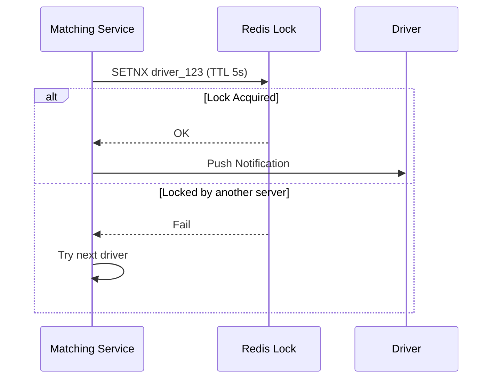

# System Design Workflow

Reference: Hello Interview - Design Uber by Evan

## 1. Requirements (<5 minutes)
- What are the functional and non functional requirements?

### Functional Requirements
- **Estimate Fair:** Users can input a start location and destination to get a price and ETA estimate.
- **Request Ride:** Users can request a ride based on an estimate and be matched with a nearby driver in real-time.
- **Driver Actions:** Drivers can accept or deny requests and navigate to pickup and drop-off locations.

### Non Functional Requirements
- **Low Latency Matching:** Matching should occur in less than 1 minute.
- **Consistency:** Strong consistency is required specifically for matching to ensure a ride is only matched to one driver at a time.
- **Availability:** High availability for all services outside of the matching process.
- **High Throughput:** Must handle massive surges (hundreds of thousands of requests) during peak hours or special events.

### Out of Scope
- Multiple car types (e.g., Uber XL, Black).
- Ratings for drivers and riders.
- Scheduled rides.
- GDPR, user privacy, and detailed monitoring/logging.

## 2. Core Entities (<3 minutes)
- **Ride:** Represents the journey, including ETA, fair, and status.
- **Driver:** Stores driver metadata and current status (available, in-ride, offline).
- **Rider:** Stores rider metadata and location.
- **Location:** Tracks the most up-to-date latitude and longitude for all drivers.

## 3. API (<5 minutes)
- **Get Fair Estimate (REST):** `POST /ride/fair-estimate` | Body: `{ source, destination }` | Returns: `{ rideId, eta, price }`.
- **Request Ride (REST):** `PATCH /ride/request` | Body: `{ rideId }` | Returns: `Status Code`.
- **Update Location (RPC/Internal):** `POST /location/update` | Body: `{ lat, lng }` (Called by drivers every ~5s).
- **Accept/Deny Ride (REST):** `PATCH /ride/driver/accept` | Body: `{ rideId, accepted: boolean }`.
- **Update Ride Status (REST):** `PATCH /ride/driver/update` | Body: `{ rideId, status }` | Returns: `next_location | null`.

## 4. Data Flow
- Drivers send periodic location updates to a Location Service which updates a specialized Location DB. 
- When a rider requests a ride, the Matching Service queries the Location DB for nearby available drivers and sends them push notifications until one accepts.

---

Up to here, you should have only spent about 15 minutes, this gives you 20 minute for your high level design and deep Dives

---

## 5. High Level Design

- **API Gateway**
    - **responsibility:** Handles load balancing, routing, authentication (via JWT/Session tokens), and rate limiting.
    - **incoming:** Writer and Driver Clients.
    - **outgoing:** Ride Service, Ride Matching Service, Location Service.

- **Ride Service**
    - **responsibility:** Calculates fair estimates (via third-party maps) and manages ride metadata.
    - **incoming:** API Gateway.
    - **outgoing:** Primary DB, Third-party Mapping API.

- **Ride Matching Service**
    - **responsibility:** Asynchronously matches riders with the most proximate available drivers.
    - **incoming:** API Gateway.
    - **outgoing:** Location DB, Notification Service.

- **Location Service**
    - **responsibility:** Ingests high-frequency location pings from drivers to keep the map state fresh.
    - **incoming:** API Gateway.
    - **outgoing:** Location DB.

## 6. Deep Dives

- **Geospatial Indexing (Geohashing in Redis)**
    - **techstack:** Redis with Geohashing.
    - **how it work:** Divides the world into a grid; Redis stores driver locations as strings that are easily searchable by proximity without expensive tree re-indexing.
    - **how it improve your system:** Handles the high write throughput (600k TPS) of driver updates much better than Quad Trees in a standard SQL DB.

- **Consistency of Matching (Distributed Locks)**
    - **techstack:** Redis / DynamoDB TTL.
    - **how it work:** When a request is sent to a driver, a distributed lock with a short TTL (e.g., 5 seconds) is created for that `driverId`.
    - **how it improve your system:** Prevents multiple matching servers from "double-booking" a single driver for different rides simultaneously.

- **Surge Management (Regional Partitioned Queues)**
    - **techstack:** Message Queue (e.g., SQS/Kafka).
    - **how it work:** Buffers incoming ride requests in a queue partitioned by geographical region.
    - **how it improve your system:** Prevents "head-of-line" blocking where hard-to-match requests in rural areas slow down matching in high-density cities.

---

## Diagrams:

### High Level System Architecture

### Distributed Matching Lock
