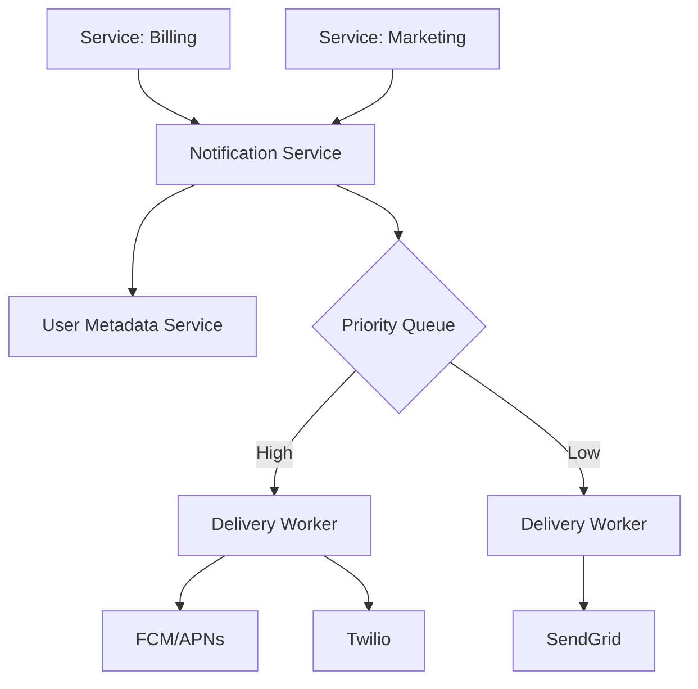
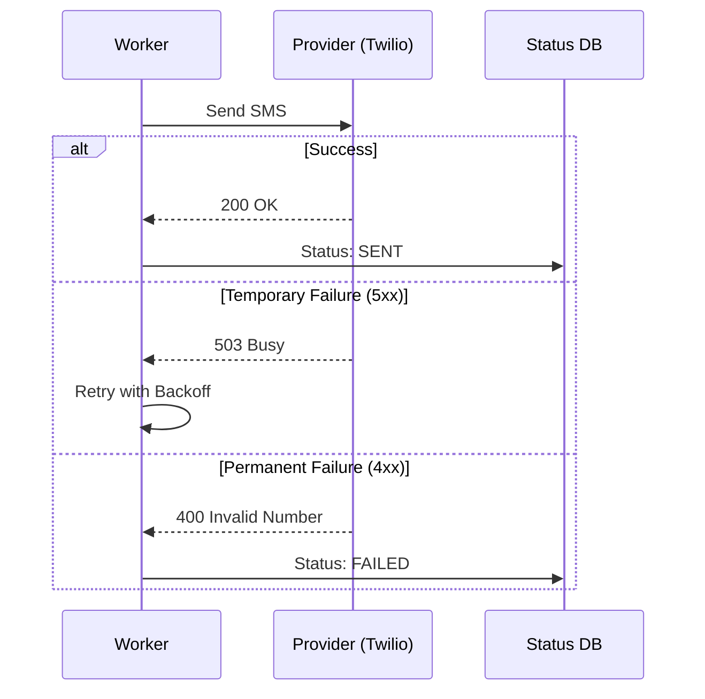

# System Design Workflow

**Reference:** Google Gemini (AI Knowledge Synthesis)

## 1. Requirements (<5 minutes)

*   What are the functional and non-functional requirements?

### Functional Requirements

*   **Multi-Channel Support:** Send notifications via Push (iOS/Android), Email, and SMS.
*   **Support Multiple Clients:** Accept notification requests from various internal microservices (e.g., Billing, Social, Marketing).
*   **Template Management:** Support pre-defined templates with placeholders for dynamic content.
*   **User Preferences:** Respect user settings for opting in/out of specific notification types.

### Non-Functional Requirements

*   **High Availability:** The system must stay up; missing a critical notification (e.g., 2FA) is a major failure.
*   **Scalability:** Handle massive bursts of traffic (e.g., breaking news or marketing campaigns).
*   **Latency:** Prioritize low latency for transactional alerts (< 1 second) while allowing batching for marketing.
*   **Reliability (At-least-once delivery):** Ensure no notification is lost, even if downstream providers (Twilio, SendGrid) fail temporarily.

### Out of Scope

*   Building the actual Push/Email/SMS delivery infrastructure (using 3rd party providers like FCM, APNs, SendGrid, Twilio).
*   Real-time in-app "bell" notification UI (focusing on delivery).

## 2. Core Entities (<3 minutes)

*   **Notification:** The core message object containing payload, recipient, and channel type.
*   **User Profile:** Stores contact info (Email, Phone, Device Tokens) and opt-in preferences.
*   **Template:** Reusable message formats with variables.

## 3. API (<5 minutes)

*   **Send Notification (REST):** `POST /v1/notifications`
    *   Body: `{ userId, templateId, params: { ... }, priority: "high"|"low" }`
    *   Returns: `notificationId`.
*   **Get Status (REST):** `GET /v1/notifications/{id}`
    *   Returns: `status: (Queued, Sent, Delivered, Failed)`.

## 4. Data Flow

*   Microservice calls API -> Auth/Validation -> Fetch User metadata -> Resolve Template -> Push to Queue -> Worker processes and calls Provider (FCM/Twilio) -> Provider notifies User.

---

Up to here, you should have only spent about 15 minutes, this gives you 20 minute for your high level design and deep Dives

---

## 5. High Level Design

*   **Notification Service (API Layer)**
    *   **responsibility:** Validates requests, authenticates the calling service, and performs initial rate limiting.
    *   **incoming:** Internal Microservices.
    *   **outgoing:** User Metadata Service, Notification Queue.

*   **User Metadata Service**
    *   **responsibility:** Provides device tokens and contact details. Checks if the user has opted out of the specific notification category.
    *   **incoming:** Notification Service.
    *   **outgoing:** User DB (NoSQL/SQL).

*   **Notification Queue (Message Broker)**
    *   **responsibility:** Decouples the API from the actual delivery workers. Prioritizes critical alerts over marketing blasts.
    *   **incoming:** Notification Service.
    *   **outgoing:** Delivery Workers.

*   **Delivery Workers**
    *   **responsibility:** Pulls notifications from the queue, executes "at-least-once" delivery logic, and interacts with third-party providers.
    *   **incoming:** Notification Queue.
    *   **outgoing:** FCM (Push), APNs (Push), SendGrid (Email), Twilio (SMS).

## 6. Deep Dives

*   **Rate Limiting & Throttling**
    *   **techstack:** Redis (Token Bucket).
    *   **how it work:** Prevents the system from overwhelming users with too many messages. If a user receives 10 notifications in a minute, subsequent messages are queued or dropped.
    *   **how it improve system:** Protects user experience and prevents our system from being flagged as "spam" by providers.

*   **Reliability & Retry Mechanism**
    *   **techstack:** Dead Letter Queues (DLQ).
    *   **how it work:** If a provider like Twilio returns a 5xx error, the worker retries with exponential backoff. If it fails 3 times, the message is moved to a DLQ for manual inspection.
    *   **how it improve system:** Ensures "At-least-once" delivery guarantees even during provider outages.

*   **Prioritization (Queue Sharding)**
    *   **how it work:** Use separate queues for "High Priority" (2FA, Password Reset) and "Low Priority" (Weekly Newsletter). Workers prioritize the high-priority queue.
    *   **responsibility:** Ensures that a massive marketing campaign doesn't delay a critical security alert.

---

## Diagrams:

### High Level Design

### At Least Once Delivery Flow
