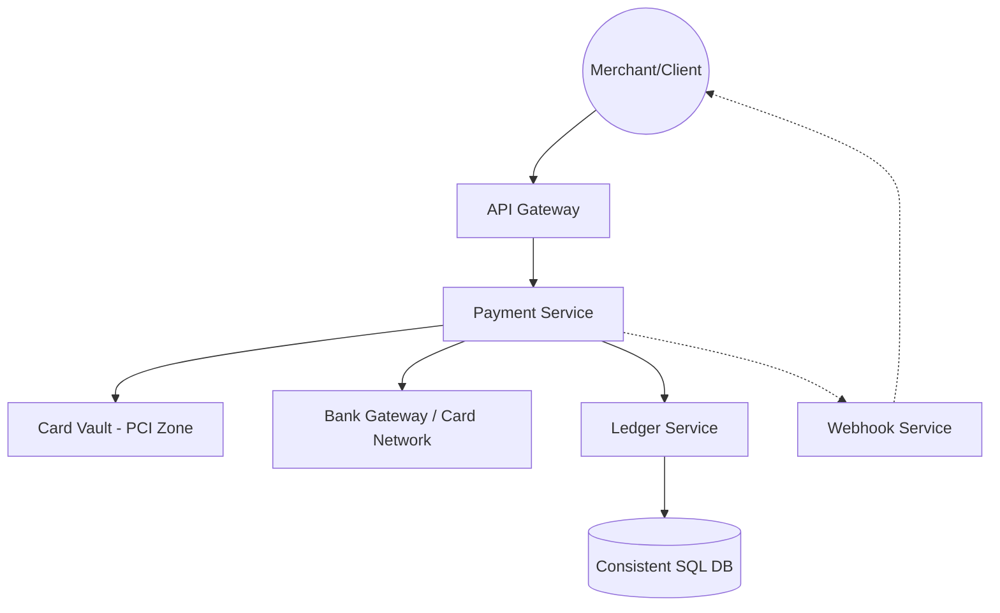
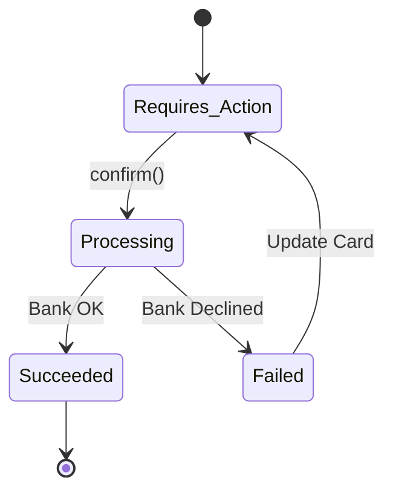

# System Design Workflow

Reference: Google Gemini (AI Knowledge Synthesis)

## 1. Requirements

### Functional Requirements

*   Process Payments: Securely handle credit/debit card transactions.
*   Merchant Integration: Provide an API for merchants to manage payments.
*   Status Tracking: Allow real-time lookup of payment states.
*   Webhooks: Notify merchant systems when payment status changes.

### Non Functional Requirements

*   Strong Consistency: Require atomic transactions.
*   High Availability: Ensure 24/7 gateway availability.
*   PCI Compliance (Security): Isolate raw card data and use tokenization.
*   Idempotency: Handle duplicate API requests without side effects.
*   Low Latency: Initial API acknowledgment and tokenization should be under 200ms.

### Out of Scope

*   Physical Point-of-Sale (POS) hardware.
*   Currency exchange (FX) rate optimization.
*   Dispute/Chargeback management UI.

## 2. Core Entities

*   Account: Represents the merchant or business.
*   Customer: The end-user making the purchase.
*   PaymentIntent: A state machine tracking a single transaction.
*   PaymentMethod: A tokenized reference to a card or bank account.

## 3. API

*   Create Intent (REST): `POST /v1/payment_intents`
    *   Body: `{ amount, currency, customerId }`
    *   Returns: `intent_id` and `client_secret`.
*   Confirm Payment (REST): `POST /v1/payment_intents/{id}/confirm`
    *   Body: `{ payment_method_id }`
    *   Returns: `status` (Succeeded, Processing, or Failed).
*   Webhook (Event): `POST <Merchant_URL>`
    *   Body: `{ event_type: "payment_intent.succeeded", data: { ... } }`

## 4. Data Flow

*   Merchant creates `PaymentIntent`. It is stored in DB as "Requires Action." The customer provides a card via a secure element. The Card Vault returns `payment_method_id`. Payment Service calls the Bank Gateway. The bank returns "Success." The Ledger is updated, and the Webhook is fired.

## 5. High Level Design

*   API Gateway
    *   Responsibility: Authentication (API Keys) and Rate Limiting.
        *   Idempotency Check: Verifies the `Idempotency-Key` header to prevent double processing.
    *   Incoming: Merchant Server / Client.
    *   Outgoing: Payment Service.
*   Payment Service (The Orchestrator)
    *   Responsibility: Manages the `PaymentIntent` state machine. Coordinates between the Vault and the external Bank Gateways.
    *   Incoming: API Gateway.
    *   Outgoing: Card Vault, Bank Gateway (Visa/MC), Ledger Service.
*   Card Vault (PCI-DSS Zone)
    *   Responsibility: Detokenizes `payment_method_id` into raw card data for the final bank call.
    *   Additional Info: Isolated from the main network to limit the scope of security audits.
    *   Incoming: Payment Service.
*   Ledger Service
    *   Responsibility: Provides an immutable, append-only record of all money movement.
    *   Incoming: Payment Service.
    *   Outgoing: Consistent Database (e.g., PostgreSQL or CockroachDB).

## 6. Deep Dives

*   Idempotency Strategy
    *   Techstack: Redis `SETNX` (Set if Not Exists).
    *   How It Works: When a request arrives with an `Idempotency-Key`, the system attempts to write it to Redis. If the key exists, it returns the cached response. If not, it processes the request and saves the result.
    *   How It Improves the System: Guarantees that a customer is never charged twice, even if there are retries.
*   Distributed Transactions (Saga Pattern)
    *   Techstack: Temporal or an internal state machine.
    *   How It Works: Since the system involves three steps (Bank call, Ledger update, Webhook), it uses a Saga. If the Ledger update fails after a successful Bank call, a "compensating transaction" is triggered or an automated retry occurs.
    *   How It Improves the System: Ensures the internal "Source of Truth" always matches the external bank's reality, maintaining 100% financial integrity.
*   PSP Gateway Failover
    *   How It Works: Stripe connects to multiple banks/acquirers globally. If one bank (e.g., Wells Fargo) returns a 503 or high latency, the Payment Service dynamically routes the request to another provider (e.g., JP Morgan).
    *   Responsibility: Maximizes the "Acceptance Rate" for merchants and ensures high availability during regional bank outages.

## Diagrams:

### High Level Architecture

### Payment State Machine
