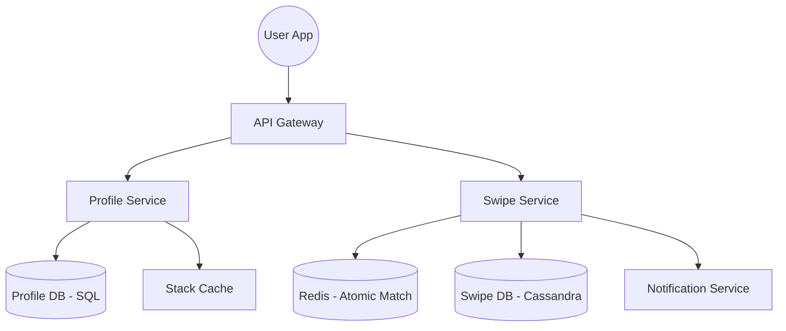
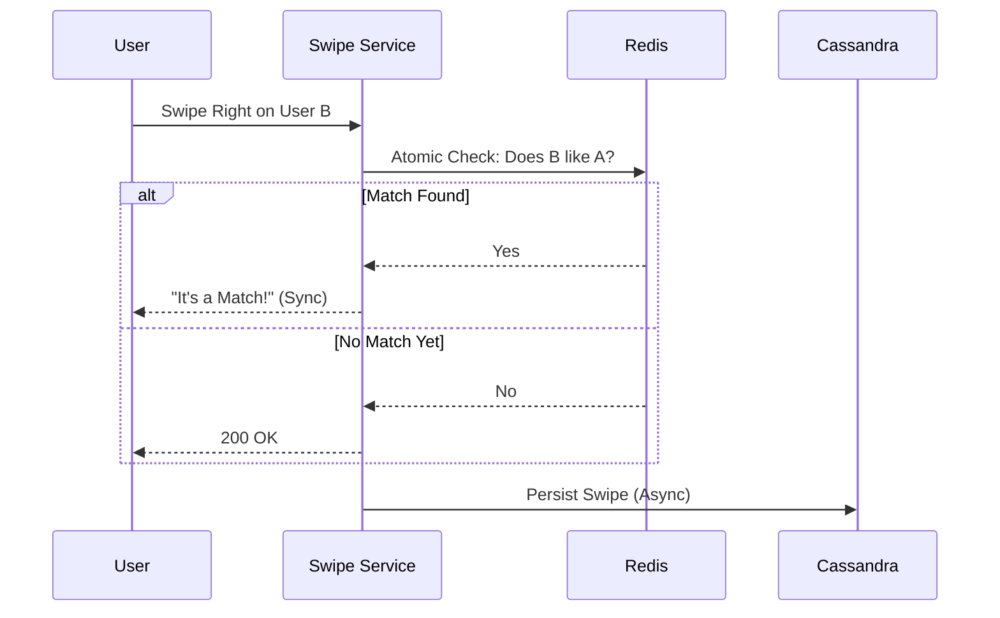

# System Design Workflow

Reference: [Hello Interview - Design Tinder by Evan](https://www.youtube.com/watch?v=18Fg5Akhkqw&list=PL5q3E8eRUieWtYLmRU3z94-vGRcwKr9tM&index=13)

## 1. Requirements (<5 minutes)

### Functional Requirements
- **Set Preferences:** Users can set matching preferences such as age range, gender, and distance.
- **View Match Stack:** Users can view a stack of potential matches based on their preferences and proximity.
- **Swipe:** Users can swipe left (no) or right (yes) on profiles.
- **Match Notification:** If two users swipe right on each other, they receive a match notification.
- **Constraint:** Avoid showing the same profile to a user twice.

### Non Functional Requirements
- **Consistency for Swipes:** Prioritize strong consistency for swipes to ensure immediate "it's a match!" notifications when a reciprocal swipe occurs.
- **Low Latency Feed:** Loading the recommendation stack should be under 300ms.
- **Scalability:** Must handle 10 million daily active users (DAU) and approximately 1 billion swipes per day.
- **Availability:** High availability for all other non-swipe parts of the system.

### Out of Scope
- Creating a full profile (uploading images, witty descriptions, etc.).
- Direct messaging (DMs) and chat functionality.

## 2. Core Entities (<3 minutes)
- **Profile:** Stores user preferences and metadata.
- **Swipe:** Persists a user's decision (yes/no) on another profile.
- **Match:** Identifies when two users have successfully matched.

## 3. API (<5 minutes)
- **Create/Update Profile (REST):** `POST /profiles` | Body: `{ min_age, max_age, gender, radius }`.
- **Get Match Stack (REST):** `GET /stacks?lat={lat}&long={long}` | Returns: `List<Profile>`.
- **Swipe on Profile (REST):** `POST /swipes/{userId}` | Body: `{ decision: "yes" | "no" }`.

## 4. Data Flow
- User updates preferences -> Profile Service updates SQL DB -> Change Data Capture (CDC) updates Search Index.
- User requests stack -> Profile Service checks Cache -> (If miss) Query ElasticSearch for geo-spatial matches -> Return stack.
- User swipes -> Swipe Service writes to Redis (for atomic match check) and Cassandra (for persistent storage).

---

## 5. High Level Design

- **API Gateway**
    - **responsibility:** Routes requests to appropriate microservices and handles authentication (JWT/Session tokens).
    - **incoming:** Client Mobile App.
    - **outgoing:** Profile Service, Swipe Service.

- **Profile Service**
    - **responsibility:** Manages user preferences and initial stack generation.
    - **additional info:** Connects to a SQL database for profile metadata.
    - **incoming:** API Gateway.
    - **outgoing:** Profile DB, Stack Cache.

- **Swipe Service**
    - **responsibility:** Processes high-throughput swipe data and detects matches.
    - **additional info:** Separated from Profile Service to scale independently for high write volume.
    - **incoming:** API Gateway.
    - **outgoing:** Swipe DB, Redis (for consistency), Notification Service.

- **Notification Service (APNs/FCM)**
    - **responsibility:** Sends push notifications for matches to the "first" swiper who is now offline/passive.
    - **incoming:** Swipe Service.

---

## 6. Deep Dives

- **Atomic Match Detection (Redis)**
    - **techstack:** Redis (Single-threaded).
    - **how it work:** Uses an atomic "Read-and-Write" operation in Redis to check for an inverse swipe while persisting the current one.
    - **how it improve system:** Solves the race condition where two simultaneous swipes might result in a "lost match" due to eventual consistency in the main DB.

- **Low Latency Stack Generation (Geo-spatial Indexing)**
    - **techstack:** ElasticSearch or PostGIS.
    - **how it work:** Uses a specialized geo-spatial index to perform two-dimensional queries (latitude/longitude) rather than inefficient standard SQL scans.
    - **how it improve system:** Reduces stack loading time from seconds to under 300ms by optimizing the heavy filtering process.

- **Avoid Repeat Profiles (Bloom Filter or TTL Cache)**
    - **techstack:** Bloom Filter or 30-day Sliding Cache.
    - **how it work:** Checks a space-efficient data structure to see if a user has already swiped on a candidate.
    - **how it improve system:** Reduces the huge storage overhead (36TB+ yearly) by either using probabilistic structures or simply expiring swipe history after 30-90 days.

---

## Diagrams:

### High Level Design

### Consistent Swipe Flow
