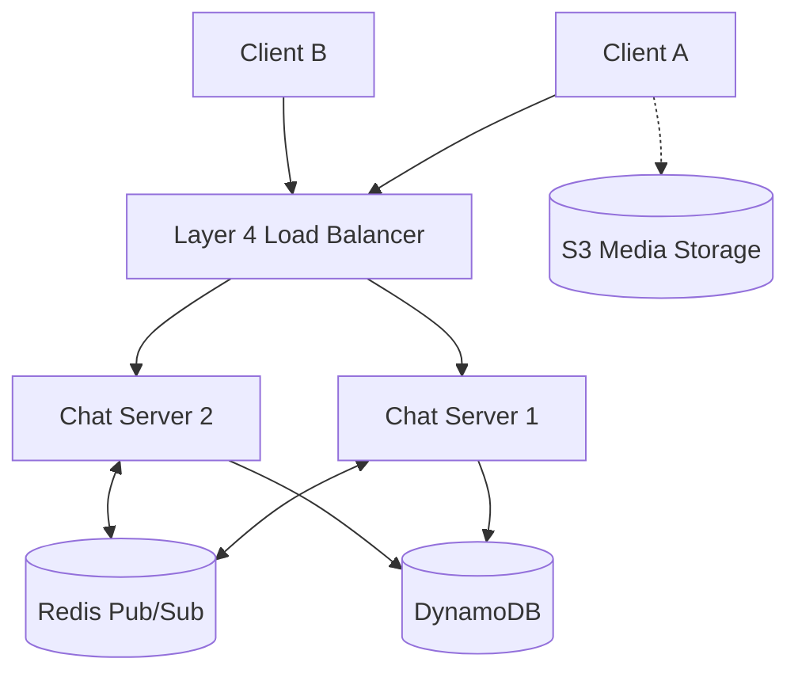
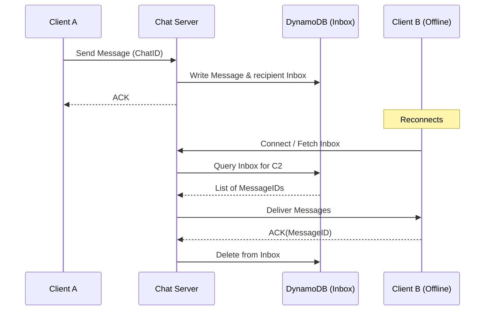

# System Design Workflow

Reference: [Hello Interview - Design WhatsApp or Messenger by Stefan](https://www.youtube.com/watch?v=cr6p0n0N-VA)

## 1. Requirements (<5 minutes)
- What are the functional and non functional requirements?

### Functional Requirements
- **Start Group Chats:** Ability to create a chat with two or more participants.
- **Send/Receive Messages:** Users should be able to exchange messages within these chats.
- **Media Attachments:** Support for sending video and audio files.
- **Offline Access:** Ability to receive and access messages that were sent while the user's device was offline.

### Non Functional Requirements
- **Latency:** Aim for roughly **500 milliseconds** for message delivery to ensure the experience feels "real-time."
- **Guarantee Delivery:** Messages must eventually reach their intended recipient.
- **Scalability:** The system must handle **billions of users** and high message throughput.
- **Privacy/Storage:** Messages should not be stored indefinitely; they should be deleted once delivered or after a set period (e.g., 30 days).
- **Fault Tolerance:** Individual component failures should not take down the entire application.

### Out of Scope
- Video and audio calling.
- Presence indicators (online/offline status) unless specifically requested by the interviewer.
- Spam prevention and security issues like scraping.

## 2. Core Entities (<3 minutes)
- **User/Actor:** All users are peers on the network.
- **Chat:** Represents a group or one-to-one conversation.
- **Message:** The individual content being sent.
- **Client/Device:** Necessary to track delivery since a user might have multiple devices (phone, laptop).

## 3. API (<5 minutes)
- **WebSocket Commands (Client to Server):**
    - `createChat`: Initiates a new conversation.
    - `sendMessage`: Sends a message to a specific chat ID.
    - `createAttachment`: Handles media uploads (likely via pre-signed URLs).
- **WebSocket Commands (Server to Client):**
    - `newMessage`: Notification and delivery of a new message.
    - `chatUpdated`: Updates when participants change or new chats are created.

## 4. Data Flow
- Client establishes a persistent WebSocket connection.
- Message sent -> Server stores in `Messages` table -> Server creates entries in `Inbox` table for each recipient.
- If recipient is online, server pushes message via WebSocket; if offline, message is fetched from `Inbox` upon reconnection.

---

## 5. High Level Design

- **Chat Server**
    - **responsibility:** Manages persistent WebSocket connections and routes messages between clients.
    - **incoming:** Client App.
    - **outgoing:** DynamoDB (Metadata/Messages), S3 (Media), Redis (Pub/Sub).

- **Database (DynamoDB)**
    - **responsibility:** Stores chat metadata, participant lists, message content, and undelivered "inbox" messages.
    - **additional info:** Uses Global Secondary Indices (GSI) to query all chats for a specific user.
    - **incoming:** Chat Server, Cleanup Service.

- **Blob Storage (S3)**
    - **responsibility:** Stores large media attachments (video/audio).
    - **incoming:** Client (via Pre-signed URLs).

## 6. Deep Dives

- **Scaling Stateful Connections (Redis Pub/Sub)**
    - **techstack:** Redis Pub/Sub.
    - **how it work:** Each Chat Server subscribes to a Redis topic for its connected users. When a message is sent to a user on a different server, the notification is published to Redis, which then routes it to the correct server.
    - **how it improve your system:** Enables horizontal scaling of chat servers while maintaining "real-time" delivery across a distributed cluster.

- **Media Uploads (Pre-signed URLs)**
    - **techstack:** S3 Pre-signed URLs.
    - **how it work:** The client requests an upload Target from the server, receives an authenticated S3 URL, and uploads media directly to S3.
    - **how it improve your system:** Offloads high-bandwidth media traffic from the chat servers, preventing them from being overwhelmed.

- **Reliable Offline Messaging (Inbox Pattern)**
    - **how it work:** Messages are written to an `Inbox` table for every recipient. When a client receives and acknowledges (`ACK`) a message, the server deletes it from the `Inbox`.
    - **how it improve your system:** Guarantees delivery even if users are offline for extended periods.

---

## Diagrams:

### High Level Design (Distributed Chat)

### Reliable Delivery Flow

