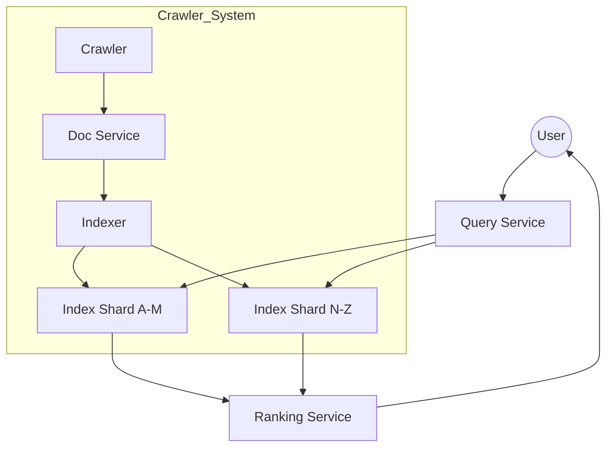
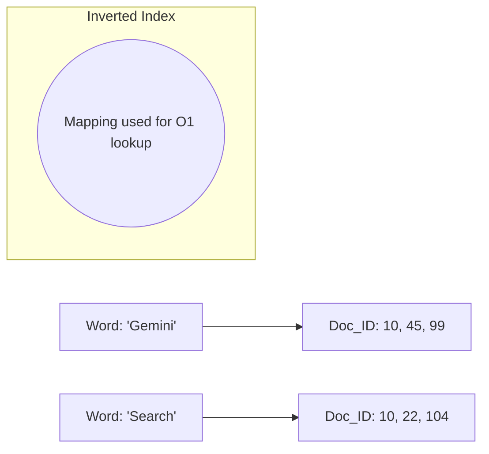

# System Design Workflow

Reference: Google Gemini (AI Knowledge Synthesis)

## 1. Requirements (<5 minutes)
- What are the functional and non functional requirements?

### Functional Requirements
- **Crawling:** Discover and fetch web pages across the internet.
- **Indexing:** Parse and store web page content in a searchable format.
- **Search/Query:** Users can input text queries and receive a ranked list of relevant pages.
- **Snippet Generation:** Display a brief summary/preview of each result.

### Non Functional Requirements
- **Low Latency:** Search results must return in < 500ms despite searching trillions of pages.
- **Scalability:** Must handle billions of queries per day and petabytes of web data.
- **Freshness:** Newly created web content should be searchable within minutes/hours.
- **High Availability:** The search engine must be accessible 24/7 (99.99% uptime).

### Out of Scope
- Image/Video specific search (focusing on Web/Text).
- Personalized ads (AdWords/AdSense).
- User search history and profile management.

## 2. Core Entities (<3 minutes)
- **WebPage:** The raw content and metadata (URL, Title) of a site.
- **Inverted Index:** A mapping of words (tokens) to the list of documents containing them.
- **Document Metadata:** Scores like PageRank, language, and authority.

## 3. API (<5 minutes)
- **Search API (REST):** `GET /search?q={query}&page={n}`
    - Returns: `List<{title, url, snippet, rank_score}>`
- **Crawl Notification (Internal):** `POST /crawl/notify`
    - Body: `{ url }` (Used to trigger manual re-indexing of a specific page).

## 4. Data Flow
- **Offline (Indexing):** Crawler -> Document Service -> Inverted Indexer -> Sharded Index Storage.
- **Online (Query):** User Query -> Query Processor -> Index Scrutiny (Scatter-Gather) -> Ranker -> Result Merger.

---

Up to here, you should have only spent about 15 minutes, this gives you 20 minute for your high level design and deep Dives

---

## 5. High Level Design

- **Web Crawler (Spider)**
    - **responsibility:** Traverses the web by following links and downloading HTML content.
    - **incoming:** Seed URLs / Frontier Queue.
    - **outgoing:** Document Service.

- **Document Service (Parsing)**
    - **responsibility:** Cleans HTML, extracts text, removes "stop words," and calculates basic metadata.
    - **incoming:** Crawler.
    - **outgoing:** Inverted Indexer.

- **Inverted Indexer**
    - **responsibility:** Builds the "back of the book" index (Word -> [DocID1, DocID2]).
    - **incoming:** Document Service.
    - **outgoing:** Sharded Index Storage.

- **Query Service**
    - **responsibility:** Orchestrates the "Scatter-Gather" pattern to query multiple index shards simultaneously.
    - **incoming:** API Gateway / User.
    - **outgoing:** Index Shards, Ranking Service.

## 6. Deep Dives

- **Inverted Index Sharding**
    - **techstack:** Document-based Sharding.
    - **how it work:** Trillions of pages are split across thousands of nodes. Each node holds the index for a subset of documents.
    - **how it improve system:** Allows parallel processing of a single query across many machines, reducing latency from seconds to milliseconds.

- **Ranking Algorithm (PageRank + BM25)**
    - **techstack:** PageRank (Graph Theory) & BM25 (Relevancy).
    - **how it work:** Scores pages based on how many high-quality sites link to them (PageRank) and how often the query terms appear in the text (BM25).
    - **responsibility:** Ensures the most "important" and relevant pages appear at the top.

- **Content Hashing (De-duplication)**
    - **techstack:** SimHash / MinHash.
    - **how it work:** Generates a fingerprint of a page's content. If two URLs have nearly identical hashes, the crawler skips the second one.
    - **how it improve system:** Saves massive amounts of storage and prevents the search results from being cluttered with duplicate sites.

---

## Diagrams:

### High Level Search Architecture

### Inverted Index Concept
