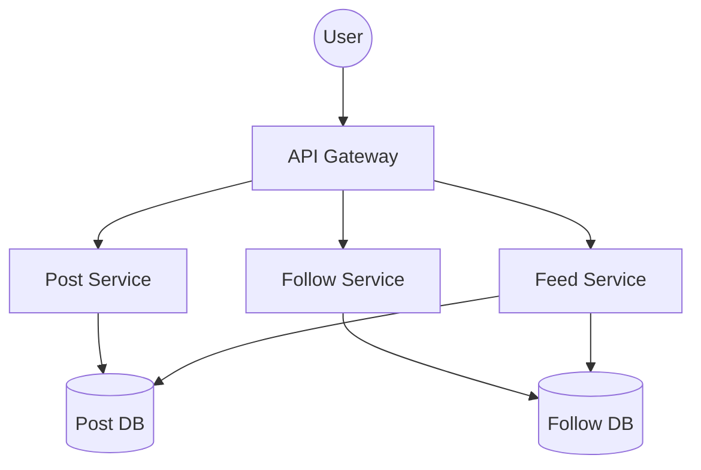
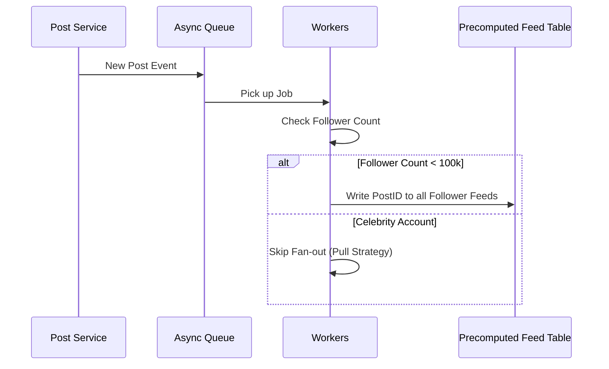

# System Design Workflow

Reference: [Hello Interview - Newsfeed System Design by Stefan](https://www.youtube.com/watch?v=Qj4-GruzyDU&list=PL5q3E8eRUieWtYLmRU3z94-vGRcwKr9tM&index=15)

## 1. Requirements (<5 minutes)

### Functional Requirements
- **Create Posts:** Users can create and publish new posts.
- **Follow Users:** Users can follow other users unidirectionally to see their content.
- **View Feed:** Users can view a chronological feed of posts from people they follow.
- **Infinite Scroll (Pagination):** Users can scroll and paginate through the feed.

### Non Functional Requirements
- **CAP Theorem:** Prioritize **Availability** over Consistency. Eventual consistency is acceptable; a post doesn't need to appear instantly in all feeds.
- **Low Latency:** Targeting roughly **500ms** for both posting and viewing to ensure a responsive UI.
- **Scalability:** Must support a scale of **2 billion users**.
- **Freshness:** Posts should appear in a user's feed within 1 minute of creation.

### Out of Scope
- Post likes and comments.
- Privacy settings for posts.
- ML-based ranking (chronological only).

## 2. Core Entities (<3 minutes)
- **User:** The person using the platform.
- **Post:** The content created by a user.
- **Follow Relationship:** The link between users.

## 3. API (<5 minutes)
- **Create Post (REST):** `POST /posts` | Body: `{ content }` | Returns: `201 Created, postId`.
- **Follow User (REST):** `PUT /users/{userId}/followers` | Returns: `200 OK`.
- **Get Feed (REST):** `GET /feed?page_size={n}&cursor={timestamp}` | Returns: `List<Post>, next_cursor`.

## 4. Data Flow
- Skipped in favor of high-level design.

---

## 5. High Level Design

- **Post Service**
    - **responsibility:** Accepts new post requests and persists them.
    - **incoming:** API Gateway / Client.
    - **outgoing:** Post Database (DynamoDB).

- **Follow Service**
    - **responsibility:** Manages the follow/unfollow relationships between users.
    - **incoming:** API Gateway / Client.
    - **outgoing:** Follow Table (DynamoDB).

- **Feed Service**
    - **responsibility:** Aggregates posts from followed users and sorts them chronologically.
    - **incoming:** API Gateway / Client.
    - **outgoing:** Follow Table, Post Table.

- **Database (DynamoDB)**
    - **responsibility:** Stores all posts and follow links.
    - **additional info:** Uses Global Secondary Indices (GSI) to query posts by user ID and follow relationships by follower/followee.

## 6. Deep Dives

- **Hybrid Fan-out (Precomputed Feed)**
    - **techstack:** DynamoDB Table + Async Worker Pool.
    - **how it work:** For standard users, posts are "pushed" (fanned-out) into a precomputed feed table for their followers. For mega-accounts (celebrities), the feed service "pulls" their posts at read-time.
    - **how it improve system:** Balances write-heavy fan-out for regular users with the read-heavy merging for celebrity accounts, preventing "write thunderstorms."

- **Hot Key Mitigation (Post Cache)**
    - **techstack:** Distributed Cache (Redis) with LFU eviction.
    - **how it work:** Popular posts (from viral users) are stored in multiple cache instances rather than sharding by post ID.
    - **how it improve system:** Prevents a single database shard or cache node from being overwhelmed by a "tidal wave" of requests for a single viral post.

---

## Diagrams:

### High Level Design

### Hybrid Fan-out Logic
