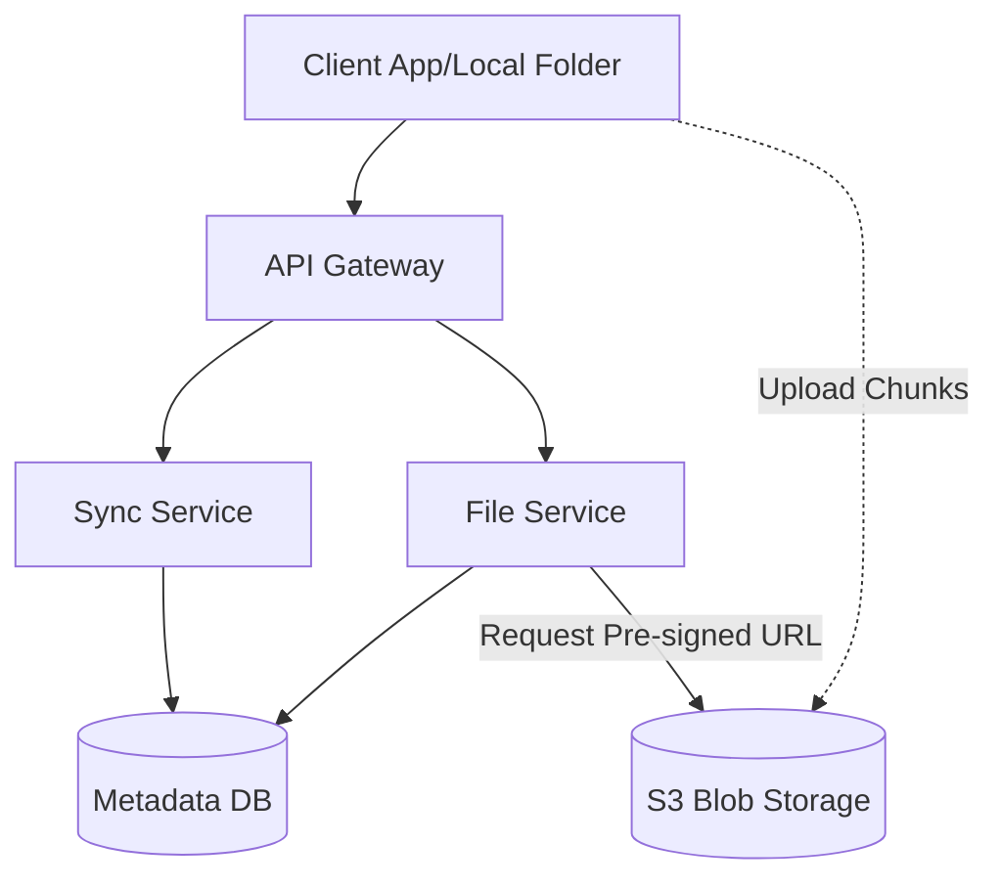
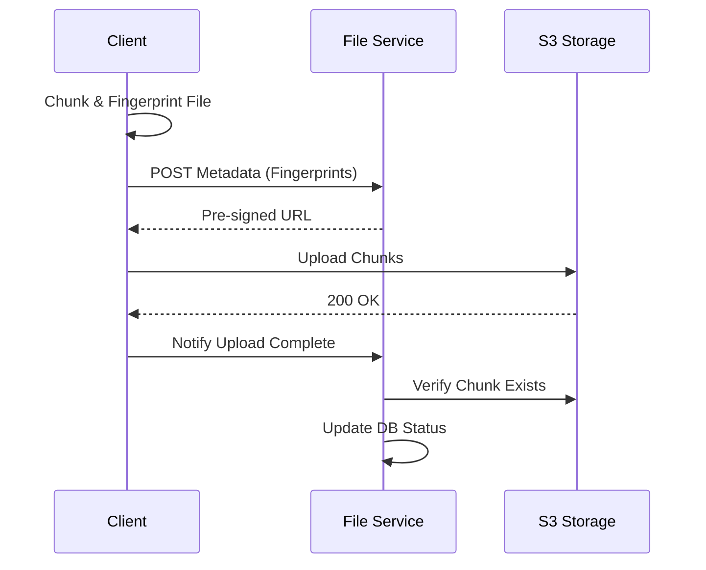

# System Design Workflow

Reference: [Hello Interview - Design Dropbox / Google Drive by Evan](https://www.youtube.com/watch?v=_UZ1ngy-kOI&list=PLlbwZHvbWtyI0d_AsZBgiMCE6Gxxc4-Sd&index=8)

## 1. Requirements (<5 minutes)

### Functional Requirements
- **Upload Files:** Ability to upload a file to remote storage.
- **Download Files:** Ability to download a file from remote storage.
- **Automatic Sync:** Sync files across multiple devices automatically (local folder to remote and vice versa).

### Non Functional Requirements
- **CAP Theorem:** Prioritize **Availability** over Consistency. It is acceptable if a user in one region sees a slightly older version of a file temporarily.
- **Low Latency:** Uploads and downloads should be as fast as possible.
- **Large File Support:** System must handle files as large as **50 GB**.
- **Resumable Uploads:** Users should not have to restart a large upload if the connection drops.
- **High Data Integrity:** Sync accuracy must be high; once stable, local and remote folders must match.

### Out of Scope
- Building or rolling a custom blob storage (e.g., Designing S3 itself).
- Collaboration features/permissions (implied focus on core storage/sync).

## 2. Core Entities (<3 minutes)
- **File:** The raw bytes of the data.
- **File Metadata:** Information about the file (name, ID, size, type, etc.).
- **User:** The owner of the files.
- **Chunk:** Small segments of a large file (used for resumable uploads).

## 3. API (<5 minutes)
- **Upload Metadata (REST):** `POST /files/metadata` - Sends file info to get a pre-signed URL.
- **Upload Chunk (Direct):** `POST <Pre-signed S3 URL>` - Client uploads raw bytes directly to blob storage.
- **Get Changes (REST):** `GET /sync/changes?timestamp={t}` - Returns metadata for files changed since a specific time.
- **Download File (REST):** `GET /files/{fileId}` - Returns metadata and a download link.

## 4. Data Flow
- Client requests pre-signed URL -> Metadata stored in DB -> Client uploads chunks to S3 -> S3/Client notifies service of completion -> Metadata status updated.

---

Up to here, you should have only spent about 15 minutes, this gives you 20 minute for your high level design and deep Dives

---

## 5. High Level Design

- **Client App**
    - **responsibility:** Watches local folder for changes, chunks files, and handles background syncing.
    - **additional info:** Contains a **Local DB** to track file fingerprints and sync state.
    - **incoming:** Operating System (File System Watcher/FS Events).
    - **outgoing:** API Gateway, Blob Storage.

- **API Gateway / Load Balancer**
    - **responsibility:** Handles authentication, rate limiting, and routes requests to microservices.
    - **incoming:** Client App.
    - **outgoing:** File Service, Sync Service.

- **File Service**
    - **responsibility:** Manages file metadata and generates pre-signed URLs for storage access.
    - **incoming:** API Gateway.
    - **outgoing:** Metadata DB, Blob Storage (S3).

- **Blob Storage (S3)**
    - **responsibility:** Optimally stores raw bytes of large files/chunks.
    - **incoming:** Client App (via pre-signed URL), File Service.

## 6. Deep Dives

- **File Chunking & Resumable Uploads**
    - **techstack:** Fingerprinting (Hashing) & Multipart Upload.
    - **how it work:** Client splits a 50GB file into 5MB chunks. Each chunk is hashed (fingerprinted). If an upload fails, the client compares local fingerprints with the server's metadata to resume only missing chunks.
    - **how it improve your system:** Enables support for very large files and ensures the user doesn't waste bandwidth restarting failed uploads.

- **Sync Optimization (Delta Sync & Adaptive Polling)**
    - **techstack:** Adaptive Polling.
    - **how it work:** The client polls the Sync Service for changes. The frequency increases if the user is active. **Delta Sync** ensures only modified chunks are downloaded rather than the entire 50GB file.
    - **how it improve your system:** Reduces latency and bandwidth usage for updates to existing files.

- **Trust But Verify Pattern**
    - **how it work:** When a chunk is uploaded to S3, the client tells the File Service it is done. The File Service then independently verifies the chunk's existence with S3 before updating the metadata status to "Complete".
    - **responsibility:** Ensures data integrity between the Metadata DB and actual storage.

---

## Diagrams:

### High Level Design

### Upload Flow
