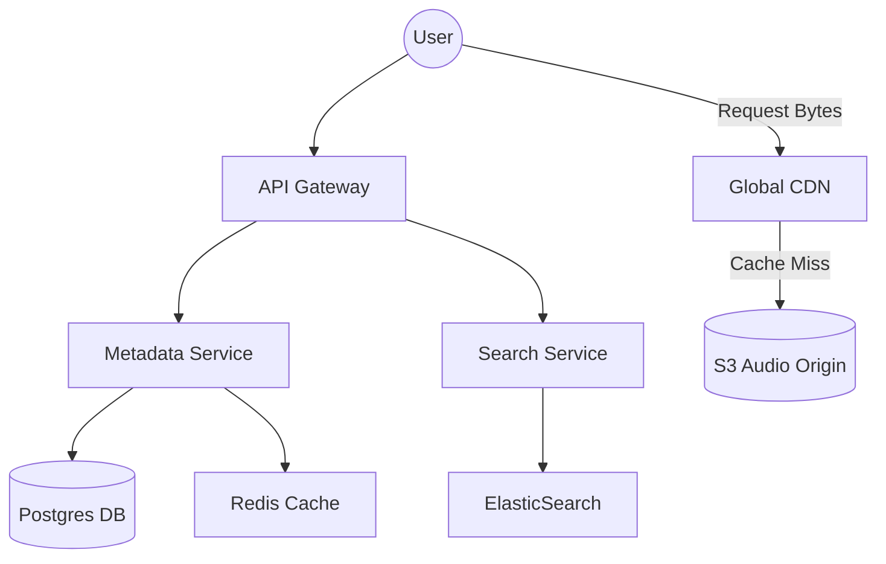
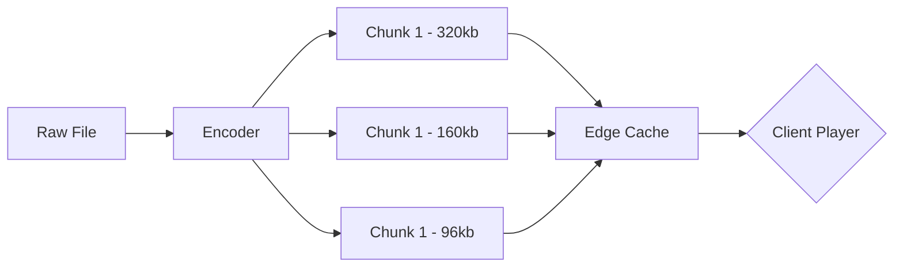

# System Design Workflow

**Reference:** AI on Google Search (AI Knowledge Synthesis)

## 1. Requirements

### Functional Requirements

*   **Play Music:** Users can stream high-quality audio tracks.
*   **Search:** Users can search for songs, albums, or artists.
*   **Playlists:** Users can create, update, and follow playlists.
*   **Library Management:** Users can "like" songs and follow artists.

### Non-Functional Requirements

*   **Low Latency Streaming:** Music must start playing quickly.
*   **High Availability:** The system must be available at all times.
*   **Scalability:** Support many active users and tracks.
*   **Eventual Consistency:** "Like" actions may take a few seconds to appear on other devices, while playback should remain responsive.

### Out of Scope

*   Real-time social feeds.
*   Podcast video streaming.
*   Offline mode.

## 2. Core Entities

*   **Track:** Song metadata (Title, ArtistID, AlbumID, S3\_URL).
*   **Artist/Album:** Entities to group tracks.
*   **Playlist:** A collection of Track IDs owned by a User.
*   **User:** Profile and subscription status.

## 3. API

*   **Get Track Metadata (REST):** `GET /tracks/{trackId}` -> Returns metadata and a CDN URL for the audio file.
*   **Search (REST):** `GET /search?q={query}&type=track,artist` -> Returns ranked results.
*   **Stream Audio (Direct):** `GET <CDN_URL>` -> Client streams bytes directly from the Edge.
*   **Toggle Like (REST):** `POST /library/likes` | Body: `{ trackId, action: 'add'|'remove' }`.

## 4. Data Flow

*   **Metadata:** Client -> API Gateway -> Track Service -> Metadata DB (SQL/NoSQL) -> Cache -> Client.
*   **Media:** Client -> CDN -> Object Storage (S3).
*   **Search:** Artist/Track data -> Ingestor -> Search Index (ElasticSearch) -> Search Service.

## 5. High Level Design

*   **API Gateway**
    *   **Responsibility:** Routes requests, handles authentication, and performs load balancing.
    *   **Incoming:** Mobile/Desktop Client.
    *   **Outgoing:** Metadata Service, Search Service, Playlist Service.
*   **Metadata Service**
    *   **Responsibility:** Manages data for tracks, artists, and albums.
    *   **Incoming:** API Gateway.
    *   **Outgoing:** PostgreSQL (Metadata), Redis (Cache).
*   **Search Service**
    *   **Responsibility:** Provides full-text search capabilities.
    *   **Incoming:** API Gateway.
    *   **Outgoing:** ElasticSearch.
*   **Audio Content Delivery Network (CDN)**
    *   **Responsibility:** Serves audio files from edge locations near the user.
    *   **Incoming:** Client.
    *   **Outgoing:** S3 Object Storage (Origin).

## 6. Deep Dives

*   **Audio Streaming Optimization (CDN & Chunking)**
    *   **Technology:** Adaptive Bitrate Streaming (ABS).
    *   **How It Works:** Audio is encoded into multiple bitrates and split into chunks. The client requests chunks based on the network speed.
    *   **Improvement:** Prevents buffering on poor connections and ensures instant start.
*   **Playlist Scalability**
    *   **Technology:** Pub/Sub + Denormalization.
    *   **How It Works:** For popular playlists, the system denormalizes the track list into a "Read-Optimized" store.
    *   **Improvement:** Prevents database crashes when many users interact with a playlist at the same time.
*   **Search Freshness (Change Data Capture)**
    *   **Technology:** Debezium / Kafka Connect.
    *   **How It Works:** When a new song is added to the SQL DB, a CDC worker pushes that record into ElasticSearch.
    *   **Responsibility:** Ensures that a song becomes searchable quickly after being uploaded.

## Diagrams:

### High Level Streaming Architecture

### Audio Chunking Flow
