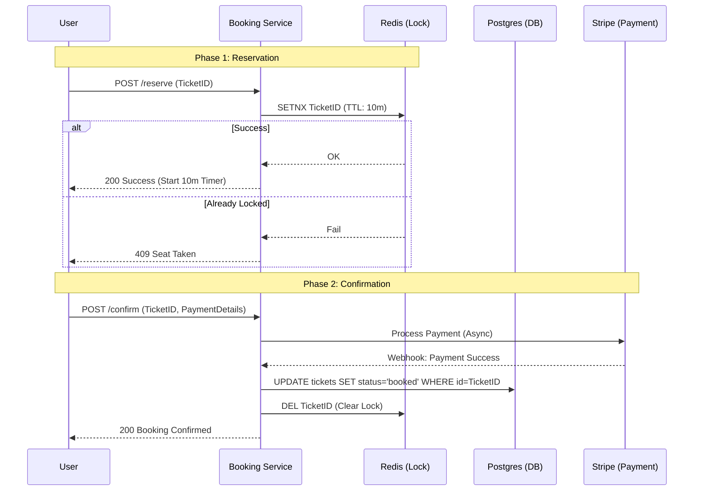

# System Design Workflow

Reference: https://www.youtube.com/watch?v=fhdPyoO6aXI&list=PLlbwZHvbWtyI0d_AsZBgiMCE6Gxxc4-Sd&index=6

## 1. Requirements (<5 minutes)
- What are the functional and non functional requirements?

### Functional Requirements
- **Book tickets**
- **View events**
- **Search for events**

### Non Functional Requirements
- **Consistency vs. Availability:** This application favors **consistency** over availability in general.
- **Consistency:** Strong consistency is required for **booking tickets**.
- **Availability:** High availability is prioritized for **searching and viewing events**.
- **Read/Write Pattern:** Reads are much greater than writes; significantly more people search than book.
- **Scalability:** Must handle surges/spikes in traffic during popular event releases.

### Out of Scope
- GDPR compliance
- Fault tolerance

## 2. Core Entities (<3 minutes)
- **Event**
- **Venue**
- **Performer**
- **Ticket**

## 3. API (<5 minutes)
- **Book tickets (2-phase process):**
    - `POST /booking/reserve` | Header: `JWT | sessionToken` | Body: `{ ticketId }`
    - `PUT /booking/confirm` | Header: `JWT | sessionToken` | Body: `{ ticketId, paymentDetails }`
- **View an event:**
    - `GET /event/{eventId}` | Returns: `Event, Venue, Performer, Ticket[]`
- **Search for an event:**
    - `GET /search?term={term}&location={location}&type={type}&date={date}` | Returns: `Partial<Event>[]`

## 4. Data Flow
- Skipped in provided documentation.

---

Up to here, you should have only spent about 15 minutes, this gives you 20 minute for your high level design and deep Dives

---

## 5. High Level Design

- **API Gateway**
    - **responsibility:**
        - Routing: takes incoming requests and routes them to the correct server/microservice.
        - Authentication and rate limiting.
    - **incoming:** Client.
    - **outgoing:** Event CRUD Service, Search Service, Booking Service.

- **Event CRUD Service**
    - **responsibility:**
        - Handles CRUD operations and the `GET /event/{eventId}` API.
    - **incoming:** API Gateway.
    - **outgoing:** Database.

- **Database**
    - **responsibility:**
        - Stores core entity data.
    - **additional info:**
        - Event table (id, venueId, performerId, tickets[], etc.).
        - Venue table (id, location, seatMap, etc.).
        - Ticket table (id, eventId, seat, price, status: {AVAILABLE, RESERVED, BOOKED}).
    - **incoming:** Event CRUD Service, Search Service, Booking Service, Cron Job.

- **Search Service**
    - **responsibility:**
        - Handles search API via SQL queries.
    - **incoming:** API Gateway.
    - **outgoing:** Database.

- **Booking Service**
    - **responsibility:**
        - Handles ticket reservation and confirmation (integrating with Stripe).
        - Manages "book tickets" with TTL.
    - **incoming:** API Gateway, Stripe Service callback.
    - **outgoing:** Database, Stripe Service, Ticket Lock.

## 6. Deep Dives

- **Elastic Search (Search Optimization)**
    - **techstack:** AWS OpenSearch.
    - **how it work:** Uses an inverted index and hashmaps to tokenize event names/descriptions for faster searching.
    - **how it improve your system:** Lowers search latency; supports geospatial "near me" queries; reduces load on primary database.
    - **responsibility:** Handle search API.
    - **additional info:** Not for main data storage; updated via Change Data Capture (CDC) from primary database.
    - **incoming:** Search Service.

- **Ticket Lock (Redis)**
    - **techstack:** Redis.
    - **how it work:** Adds `ticketId` to cache with a 10-minute TTL when a user reserves a ticket.
    - **how it improve your system:** Ensures consistency during the booking window; more efficient than standard DB status updates.
    - **incoming:** Booking Service.

- **Virtual Waiting Queue**
    - **techstack:** Redis Sorted Set.
    - **how it work:** A buffer where users wait during high-traffic surges.
    - **how it improve your system:** Protects the backend from crashing during massive traffic spikes (e.g., "Taylor Swift" level traffic); improves UX with a "fair" queue.
    - **incoming:** API Gateway.
    - **outgoing:** Booking Service (once dequeued).

---

## Diagrams:

