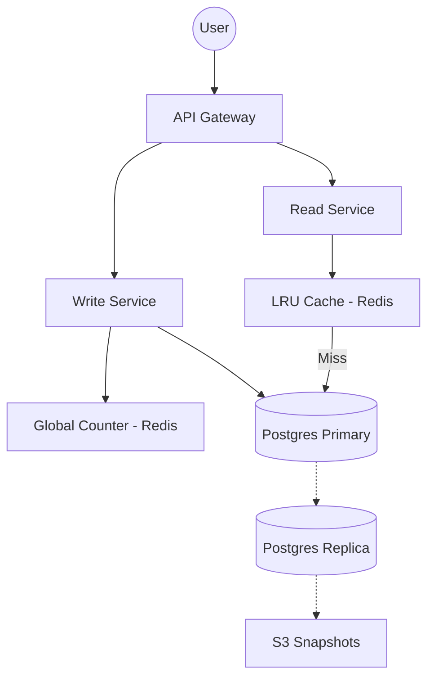
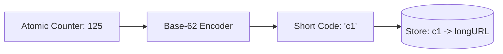

# System Design Workflow

Reference: [Hello Interview - Design a URL Shortener by Evan](https://www.youtube.com/watch?v=iUU4O1sWtJA&list=PLlbwZHvbWtyI0d_AsZBgiMCE6Gxxc4-Sd&index=4)

## 1. Requirements (<5 minutes)

### Functional Requirements
- **Create Short URL:** Users can provide a long URL and get a shortened version.
- **Redirection:** Users clicking a short URL are redirected to the original long URL.
- **Custom Alias (Optional):** Users can optionally provide their own short code (e.g., `bit.ly/evan`).
- **Expiration (Optional):** Users can set a TTL (Time to Live) after which the link is invalid.

### Non Functional Requirements
- **Low Latency:** Redirects must be "real-time" (< 200ms).
- **High Availability:** Prioritized over strong consistency; eventual consistency is acceptable.
- **Scalability:** Support 100 million DAU and 1 billion total URLs.
- **Uniqueness:** Short codes must be unique to prevent collisions.

### Out of Scope
- Detailed user management (password hashing, salts, etc.).
- Back-of-the-envelope math is deferred until specific design decisions require it.

## 2. Core Entities (<3 minutes)
- **URL Mapping:** Stores the relationship between the `short_code` and `original_url`.
- **User:** The owner/creator of the links.

## 3. API (<5 minutes)
- **Shorten URL:** `POST /urls` | Body: `{ originalUrl, customAlias?, expiration? }` | Returns: `shortUrl`.
- **Redirect:** `GET /{shortCode}` | Returns: `302 Redirect` to the original long URL.

## 4. Data Flow
- **Write:** Request -> Service -> Generate Code -> Store in DB -> Return to User.
- **Read:** Request -> Service -> Cache Lookup -> (DB Lookup if Miss) -> 302 Redirect.

---

## 5. High Level Design

- **API Gateway**
    - **responsibility:** Entry point that routes traffic to the correct service.
    - **incoming:** Client.
    - **outgoing:** Read Service, Write Service.

- **Write Service**
    - **responsibility:** Generates unique short codes and persists them.
    - **incoming:** API Gateway.
    - **outgoing:** Database, Global Counter.

- **Read Service**
    - **responsibility:** High-performance redirection via cache lookups.
    - **incoming:** API Gateway.
    - **outgoing:** Redis Cache, Database.

- **Database (PostgreSQL)**
    - **responsibility:** Persistent storage for all URL mappings.
    - **additional info:** Uses a B-Tree index on the short code primary key for fast lookups.
    - **incoming:** Read/Write Services.

## 6. Deep Dives

- **Unique Code Generation (Base-62 & Counter)**
    - **techstack:** Redis `INCR` + Base-62 Encoding.
    - **how it work:** A global counter increments for every new URL. This number is converted to Base-62 (0-9, a-z, A-Z) to keep the code short (e.g., 6 chars support ~56 billion combinations).
    - **how it improve system:** Guarantees 100% uniqueness without a slow "read-before-write" check in the main DB.

- **Latency Optimization (LRU Cache)**
    - **techstack:** Redis / Memcached.
    - **how it work:** A "Read-Through" cache stores hot URL mappings in RAM. Old, unused links are evicted via Least Recently Used (LRU) policy.
    - **how it improve system:** Moves redirection lookups from disk (SSD) to memory (RAM), achieving O(1) time complexity.

- **Database Availability & Scaling**
    - **techstack:** Read Replicas & S3 Snapshots.
    - **how it work:** While 1B URLs only take ~500GB (fitting on one SSD), we use a replica for failover. Periodic snapshots are stored in S3 for disaster recovery.
    - **how it improve system:** Ensures the system stays online even if the primary database node fails.

---

## Diagrams:

### High Level System Architecture

### Base-62 Generation Logic

